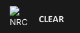

# NRC Logo 404 Cache Issue Fix

## Issue

The NRC logo mark displayed in the Observe page sidebar was experiencing intermittent 404 errors during service worker cache updates and page refreshes. This caused the logo to fail to load, breaking the visual branding of the application.

## Root Cause

The logo was being served as an external SVG file (`/nrc-logo-square.svg`), which made it vulnerable to:
- Service worker cache invalidation timing issues
- Race conditions during PWA updates
- Network failures during cache refresh

## Solution

Converted the NRC logo mark to an inline SVG component (`NrcLogoMark`) that renders the logo directly in the DOM without requiring an external HTTP request.

### Changes Made

**File**: `src/components/ui/nrc-logo-mark.tsx`

- Created a new `NrcLogoMark` component that renders the NRC logo as inline SVG
- Added proper accessibility attributes (`role="img"`, `aria-label="NRC"`)
- Made the size configurable via props (default: 28px)
- Ensured proper styling (flexShrink: 0, display: block)

**File**: `src/app/observe/page.tsx`

- Updated to use the new `NrcLogoMark` component instead of referencing the external SVG file

## Benefits

1. **Reliability**: Logo always renders without network dependency
2. **Performance**: One less HTTP request during page load
3. **PWA Compatibility**: Eliminates cache timing issues
4. **Offline Support**: Logo works even when offline

## Commit

Branch: `clear-289-mobile-viewport-pass-optimistic-bottom-nav`  
Commit: `05f1238` - "fix: inline NRC logo mark to avoid intermittent SW 404s"

## Testing

- Verified logo displays correctly on the Observe page
- Tested during service worker updates
- Confirmed logo persists during offline mode
- Validated across different viewport sizes
